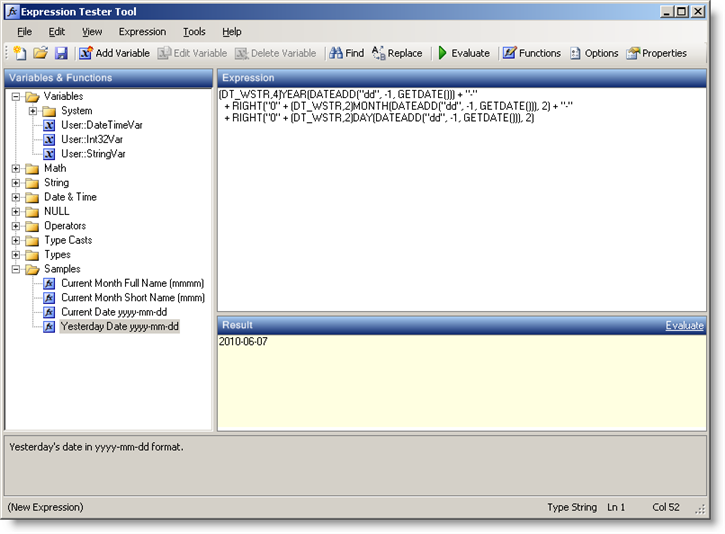
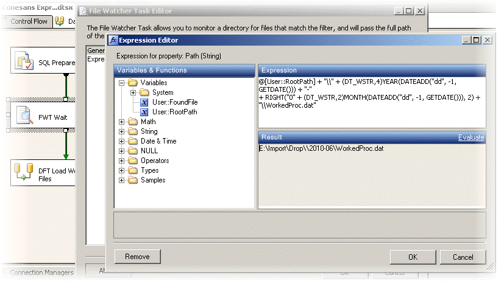
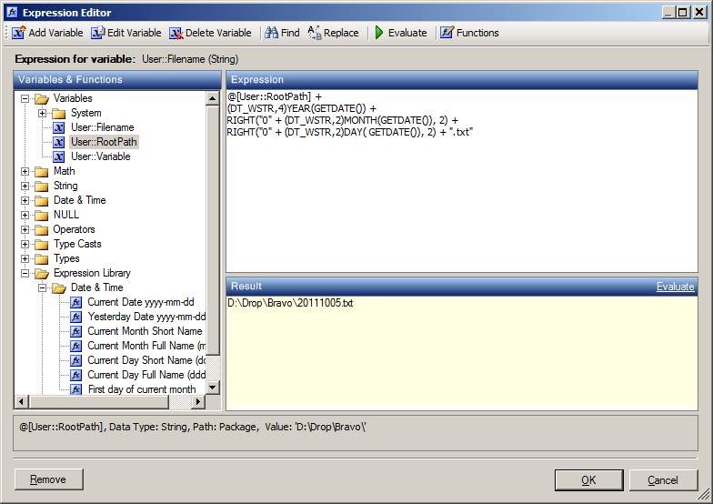

# SSIS Expression Editor & Tester
## Downloads
See [Releases folder for the latest downloads](https://github.com/sqlgreen/SSIS-Expression-Editor/tree/master/Main/Releases)
## Expression Tester
The expression tester tool is a standalone application that allows you to easily develop and test expressions. It is like a workbench to quickly try things without having to open a package or mess up the one your currently working on. It is designed to be easily portable, just extract the files and run, but it does require SQL Server Integration Services to be installed on the machine. 

Choose the download that matches the version of SQL Server you have installled. They are all built from the same code with the same functionality, but each targeting a different version of SQL Server.
* SQL Server 2014 (v12)
* SQL Server 2016 (v13)
* SQL Server 2017 (v14)
* SQL Server 2019 (v15)

There are additional downloads for 
* SQL Server 2005 (v9)
* SQL Server 2008, which includes 2008 R2 (v10)
* SQL Server 2012 (v11)

## Expression Editor Control
The expression editor control used in the tester tool has been deliberately made available as a separate component so it can be easily re-used in other tools and custom tasks, for example it is integrated into [BI Developer Extensions](https://bideveloperextensions.github.io/).

Whilst it was inspired by the Microsoft editor the number one feature I wanted was resizable panes. It also has the usual things like copy and paste as well as fine grained undo/redo. You can drag and drop between the functions tree and the expression or double-click to add it to the expression. It also includes a built in editor for the functions list, use the right-click context menu to toggle edit mode on or off.

The functions tree is saved to an XML file as soon as you make any changes. The default location is under your application data (e.g. C:\Users\_Darren Green_\AppData\Roaming\Konesans Limited\Expression Editor\ExpressionEditor.xml) and will be shared across all applications that use the control. If using the expression tester and you'd like it to be more portable you can place the functions XML file in the same folder as the executable and that will take precedence. The default file is available on the downloads page.

F5 is the short-cut key to evaluate an expression.

A screenshot of the expression tester tool in action:

An example custom task that uses the expression editor control:

The editor control dialog as used by [BI Developer Extensions](https://bideveloperextensions.github.io/) in the [Expression List](https://bideveloperextensions.github.io/features/ExpressionList/) and [Variables Window Extensions](https://bideveloperextensions.github.io/features/VariablesWindowExtensions/) features.

