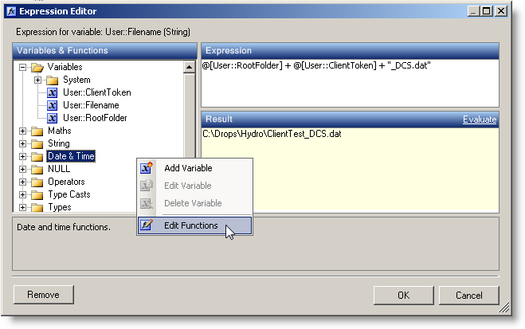
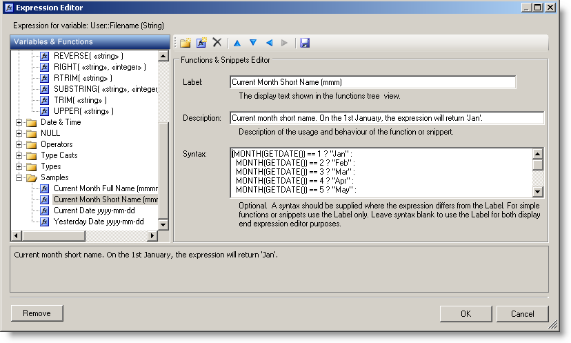

**Expression Editor Control**
To enter (or leave) the functions editor just right-click the tree view and toggle Edit Functions.

**Expression Tester**
To enter the functions editor click Functions on the main toolbar or right-click the tree view and toggle Edit Functions as for the control.

